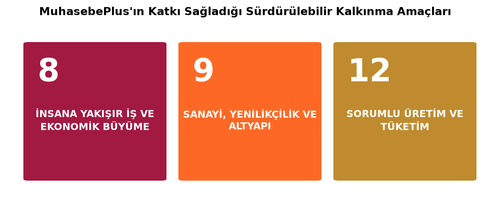
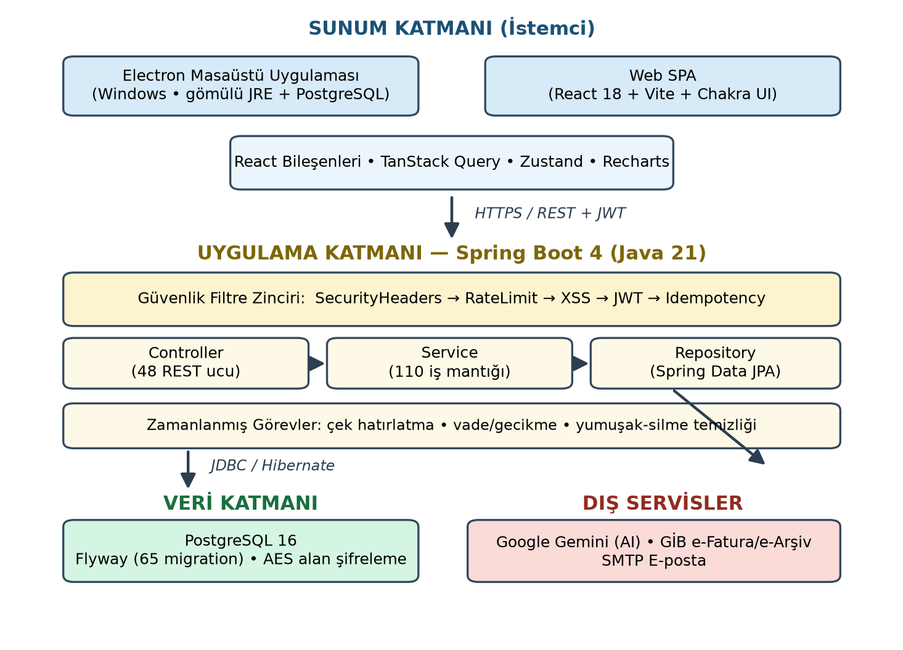
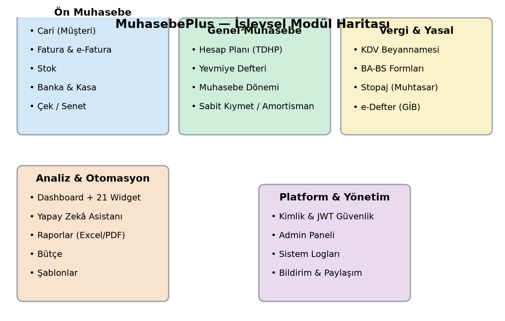

# MUHASEBEPLUS (M+)
### Web ve Masaüstü Tabanlı Bütünleşik Muhasebe ve e-Dönüşüm Platformu

**Beykent Üniversitesi — Yazılım Mühendisliği Bölümü**  
**Yazılım Mühendisliği Bitirme Projesi — Final Raporu**  
**2026 – BAHAR**

**Danışman Öğretim Üyesi:** ____________________________

**Takım Üyeleri:** Emre Zeytin, Emre Sonal, Ahmet Faruk Altıok


---


# İÇİNDEKİLER

> İçindekiler (Word .docx sürümünde otomatik, sayfa numaralı olarak üretilir).

- ÖZET
- 1. GİRİŞ — 1.1 SKA · 1.2 Gerçekçi Koşullar ve Kısıtlar · 1.3 Bilgi/Beceri/Farkındalık · 1.4 Genel Bilgiler
- 2. MEVCUT UYGULAMA VE ÇALIŞMALAR — 2.1 … 2.6
- 3. GELİŞTİRME SÜRECİ: TEKNOLOJİLER, ARAÇLAR VE TEKNİKLER — 3.1 … 3.10
- 4. SONUÇLAR VE TARTIŞMA
- 5. KAYNAKLAR


# ŞEKİLLER LİSTESİ

Şekil 1: MuhasebePlus’ın katkı sağladığı Sürdürülebilir Kalkınma Amaçları

Şekil 2: MuhasebePlus katmanlı sistem mimarisi

Şekil 3: MuhasebePlus işlevsel modül haritası


# RESİM LİSTESİ

Resim 1: Giriş (oturum açma) ekranı

Resim 2: Ana gösterge paneli (Dashboard) ve widget’lar

Resim 3: Fatura oluşturma ekranı (KDV/iskonto/tevkifat)

Resim 4: Cari (müşteri) yönetimi ekranı

Resim 5: Hesap planı ve yevmiye defteri ekranı

Resim 6: Beyanname (KDV/BA-BS/Stopaj) ekranı

Resim 7: e-Defter üretim ekranı

Resim 8: Banka & kasa ve mutabakat ekranı

Resim 9: Yapay zekâ destekli widget oluşturma ekranı

Resim 10: Yönetim (admin) paneli ekranı


# KISALTMA LİSTESİ


| Kısaltma | Açıklama |
|---|---|
| AES | Advanced Encryption Standard — Gelişmiş Şifreleme Standardı |
| API | Application Programming Interface — Uygulama Programlama Arayüzü |
| BA-BS | Mal ve Hizmet Alımlarına/Satışlarına İlişkin Bildirim Formları |
| CI/CD | Continuous Integration / Continuous Delivery — Sürekli Tümleştirme/Teslim |
| CRUD | Create-Read-Update-Delete — Oluştur-Oku-Güncelle-Sil |
| DTO | Data Transfer Object — Veri Taşıma Nesnesi |
| GİB | Gelir İdaresi Başkanlığı |
| JPA | Jakarta Persistence API (Nesne-İlişkisel Eşleme) |
| JWT | JSON Web Token — Kimlik Doğrulama Belirteci |
| KDV | Katma Değer Vergisi |
| KOBİ | Küçük ve Orta Büyüklükteki İşletme |
| ORM | Object-Relational Mapping — Nesne-İlişkisel Eşleme |
| REST | Representational State Transfer (Web Servis Mimarisi) |
| SKA | Sürdürülebilir Kalkınma Amaçları (BM) |
| SMMM | Serbest Muhasebeci Mali Müşavir |
| SPA | Single Page Application — Tek Sayfa Uygulaması |
| TDHP | Tek Düzen Hesap Planı |
| UBL-TR | Universal Business Language — Türkiye e-Fatura Standardı |
| VKN/TCKN | Vergi Kimlik No / T.C. Kimlik No |
| VUK | Vergi Usul Kanunu |
| XSS | Cross-Site Scripting — Siteler Arası Betik Çalıştırma |
| YZ | Yapay Zekâ |


# ÖZET

Bu çalışmada, küçük ve orta büyüklükteki işletmeler (KOBİ) ile serbest muhasebeci mali müşavirlerin (SMMM) gereksinimlerini tek bir çatı altında karşılamayı amaçlayan, web ve masaüstü ortamlarında çalışabilen, çok kiracılı (multi-tenant) bütünleşik bir muhasebe ve e-dönüşüm platformu olan MuhasebePlus geliştirilmiştir. Uygulama; cari (müşteri) yönetiminden faturalamaya, stok ve banka/kasa takibinden çek-senet portföyüne, Tek Düzen Hesap Planı (TDHP) temelli genel muhasebe ve yevmiye defterinden Katma Değer Vergisi (KDV), BA-BS ve stopaj beyannamelerine, e-Deftere, sabit kıymet amortismanına ve yapay zekâ destekli yönetim gösterge paneline kadar uçtan uca bir iş akışı sunar.

Projenin motivasyonu, ülkemizde KOBİ’lerin kullandığı muhasebe yazılımlarının çoğunlukla yüksek lisans maliyetli, yalnızca buluta bağımlı ve çok sayıda ayrı araca dağılmış olması; ayrıca zorunlu hâle gelen e-dönüşüm süreçlerinin (e-Fatura, e-Defter) küçük işletmeler için karmaşık kalmasıdır. Buna karşılık MuhasebePlus, açık kaynaklı bir teknoloji yığını üzerinde, verisini kendi makinesinde tutmak isteyen kullanıcılar için masaüstü, merkezî erişim isteyenler için web olmak üzere ikili dağıtım modeliyle erişilebilir bir çözüm hedefler.

Yöntem olarak; arka uçta Java 21 ve Spring Boot 4 ile katmanlı (Controller–Service–Repository) bir REST mimarisi, ön uçta React 18 tabanlı bir Tek Sayfa Uygulaması (SPA) ve masaüstü dağıtımı için Electron kullanılmıştır. Veri katmanında PostgreSQL ile Flyway veritabanı göçleri, güvenlik katmanında JWT tabanlı kimlik doğrulama, BCrypt parola özetleme, hız sınırlama, XSS süzme ve hassas alanların AES ile şifrelenmesi uygulanmıştır. Beyanname ve mali tablolar Apache POI/PDFBox ile, e-Fatura ise GİB UBL-TR standardında üretilmekte; gösterge panelindeki akıllı widget’lar Google Gemini modeliyle oluşturulmaktadır.

Elde edilen sonuçlar: 48 REST denetleyicisi, 110 servis sınıfı, 98 varlık (entity), 57 depo (repository) ve 65 veritabanı göçünden oluşan, yaklaşık 29.000 satırlık bir arka uç ile 36 sayfa, 33 servis ve 21 gösterge widget’ı içeren yaklaşık 17.000 satırlık bir ön uçtan oluşan, üretime yakın olgunlukta bir uygulamadır. Sistem; faturadan otomatik çift taraflı yevmiye kaydı üretimi, dönem bazlı otomatik KDV/tevkifat hesabı, kapalı dönem ve tenant izolasyonu denetimleri gibi gerçek mali kuralları içermektedir.

Bu sonuçlar; yazılım mühendisliği eğitiminde edinilen katmanlı mimari, güvenlik, veritabanı tasarımı ve test mühendisliği bilgilerinin, gerçek Türk mali mevzuatının (TDHP, KDV, e-dönüşüm) karmaşık kurallarıyla bir araya getirilerek işlevsel, sürdürülebilir ve ölçeklenebilir bir ürüne dönüştürülebildiğini göstermektedir.

**Anahtar kelimeler:** muhasebe yazılımı, e-Fatura, e-Defter, KDV beyannamesi, Spring Boot, React, Electron, çok kiracılı mimari, yapay zekâ, KOBİ.
Anahtar kelimeler: muhasebe yazılımı, e-Fatura, e-Defter, KDV beyannamesi, Spring Boot, React, Electron, çok kiracılı mimari, yapay zekâ, KOBİ.


# 1. GİRİŞ


## 1.1 BİRLEŞMİŞ MİLLETLER SÜRDÜRÜLEBİLİR KALKINMA AMAÇLARI (SKA)

MuhasebePlus, Birleşmiş Milletler tarafından tanımlanan Sürdürülebilir Kalkınma Amaçları (SKA) kapsamında doğrudan üç amaçla ilişkilidir (Şekil 1):

- SKA 8 — İnsana Yakışır İş ve Ekonomik Büyüme: KOBİ’lere ve mali müşavirlere erişilebilir, düşük maliyetli bir muhasebe altyapısı sunarak işletmelerin mali süreçlerini düzenli ve kayıtlı biçimde yürütmesine katkı sağlar. Faturadan beyannameye kadar otomatikleştirilmiş iş akışı, kayıt dışılığı azaltan ve verimliliği artıran bir araçtır.
- SKA 9 — Sanayi, Yenilikçilik ve Altyapı: Açık kaynaklı, yerli olarak geliştirilmiş, yapay zekâ ile zenginleştirilmiş bir dijital altyapı örneğidir. e-Fatura/e-Defter gibi dijital dönüşüm bileşenlerini küçük işletmeler için ulaşılabilir kılar.
- SKA 12 — Sorumlu Üretim ve Tüketim: e-Fatura, e-Defter ve elektronik beyanname üretimiyle kâğıt, baskı ve fiziksel arşiv tüketimini azaltır; masaüstü modunda yerel çalışarak merkezî sunucu enerji tüketimini en aza indirir.



<p align="center"><b>Şekil 1: MuhasebePlus’ın katkı sağladığı Sürdürülebilir Kalkınma Amaçları</b></p>


## 1.2 GERÇEKÇİ KOŞULLAR VE KISITLAR

Geliştirilen ürün yalnızca teknik açıdan değil; ekonomik, çevresel, kullanıcı odaklı ve operasyonel boyutlarıyla gerçek hayat koşullarında uygulanabilir olacak biçimde tasarlanmıştır.

- Teknik koşullar: Java 21 / Spring Boot 4, React 18 ve PostgreSQL gibi güncel ve yaygın desteklenen teknolojiler seçilmiş; masaüstü dağıtımında gömülü PostgreSQL ve gömülü JRE ile kullanıcının ek kurulum yapmasına gerek bırakılmamıştır.
- Ekonomik koşullar: Tüm yığın açık kaynaklıdır; lisans maliyeti yoktur. Masaüstü dağıtımında barındırma (hosting) maliyeti sıfırdır, SaaS dağıtımında ise tek bir sunucu yeterlidir.
- Çevresel koşullar: Kâğıtsız (paperless) belge üretimi ve yerel çalışma seçeneğiyle düşük enerji/karbon ayak izi hedeflenmiştir.
- Kullanıcı odaklı koşullar: Tümüyle Türkçe arayüz, TDHP ve KDV mevzuatına uyumlu veri modeli, klavye kısayolları, komut paleti, aydınlık/karanlık tema ve sade bir kullanıcı deneyimi.
- Operasyonel koşullar: Flyway ile sürümlenebilir veritabanı göçleri, GitHub Actions ile sürekli tümleştirme (CI), Electron otomatik güncelleme ve merkezî loglama.

Başlıca kısıtlar: GİB e-Fatura entegrasyonu yasal sertifikasyon gerektirdiğinden test ortamına (efaturatest.efatura.gov.tr) karşı geliştirilmiştir; yapay zekâ özellikleri dış servis (Gemini) maliyeti taşıdığından aylık jeton (token) kotasıyla sınırlandırılmıştır; proje bir dönemlik süre ve üç kişilik bir ekip kısıtı altında yürütülmüştür.


## 1.3 BİTİRME ÇALIŞMASINDAN SAĞLANAN BİLGİ, BECERİ VE FARKINDALIKLAR

Bilgi: Bu çalışma boyunca katmanlı yazılım mimarisi, REST servis tasarımı, nesne-ilişkisel eşleme (ORM/JPA), ilişkisel veritabanı tasarımı ve göç yönetimi, kimlik doğrulama/yetkilendirme ve uygulama güvenliği, test mühendisliği ve sürekli tümleştirme konularındaki kuramsal bilgiler pekiştirilmiştir. Bunun yanında çift taraflı kayıt esaslı muhasebe, Tek Düzen Hesap Planı, KDV/tevkifat mekaniği, beyanname ve e-dönüşüm (e-Fatura, e-Defter) gibi alan bilgileri kazanılmıştır.

Beceri: Spring Boot ile kurumsal arka uç geliştirme, React/Vite ile modern ön uç geliştirme, Electron ile masaüstü paketleme, SQL/Flyway ile veri modelleme, Git ile takım hâlinde sürüm yönetimi ve yapay zekâ servislerinin (Gemini) bir ürüne entegrasyonu konularında uygulamalı beceriler edinilmiştir. Bu beceriler, projedeki 65 veritabanı göçü, otomatik testler ve CI yapılandırması gibi somut çıktılarla ölçülebilir biçimde gösterilmiştir.

Farkındalık: Mali mevzuata uyumun ve hesaplama doğruluğunun kritikliği, kişisel/finansal verilerin korunmasına ilişkin KVKK ve veri güvenliği sorumlulukları ve dijitalleşmenin sürdürülebilirliğe katkısı konusunda farkındalık gelişmiştir.

Katılınan etkinlikler (tarih ve ad ile): __________________________________________________ (Bu alan, ekip üyelerinin dönem içinde online/yüz yüze katıldığı kariyer/teknik etkinliklerle doldurulacaktır.)


## 1.4 GENEL BİLGİLER

Türkiye’de küçük işletmelerin muhasebe ihtiyaçları çoğunlukla pahalı masaüstü paket programları, yalnızca buluta bağımlı abonelik servisleri veya birbirinden kopuk (fatura ayrı, stok ayrı, beyanname ayrı) araçlarla karşılanmaktadır. Bu durum; maliyet, veri gizliliği ve süreç bütünlüğü açısından sorun yaratmakta, e-dönüşüm zorunlulukları ise küçük işletmeler için ek bir karmaşıklık doğurmaktadır.

MuhasebePlus, bu sorunu tek bir bütünleşik platformda çözmeyi hedefler. Çözümün uygulamadaki başlıca avantajları: (i) ön muhasebe, genel muhasebe ve vergi/e-dönüşüm süreçlerini tek uygulamada birleştirmesi; (ii) hem web hem masaüstü çalışarak verinin yerelde tutulabilmesine olanak vermesi; (iii) faturadan yevmiyeye, yevmiyeden beyannameye uzanan zinciri otomatikleştirerek hata payını azaltması; (iv) yapay zekâ ile veriden içgörü üretmesi; ve (v) açık kaynaklı yığını sayesinde düşük toplam sahip olma maliyeti sunmasıdır.


# 2. MEVCUT UYGULAMA VE ÇALIŞMALAR


## 2.1 BENZER ÇALIŞMALAR VE KARŞILAŞTIRMA

Muhasebe ve ön muhasebe alanında olgun ticari çözümler mevcuttur. Yerli pazarda Logo İşbaşı ve Logo Tiger, Mikro, Paraşüt, Uyumsoft, Bizimhesap ve TÜRMOB’un Luca platformu; uluslararası pazarda ise QuickBooks (Intuit), Zoho Books ve Xero öne çıkan örneklerdir (Paraşüt, 2024; Logo Yazılım, 2024; Intuit QuickBooks, 2024). Bu ürünlerin büyük çoğunluğu yalnızca bulut (SaaS) tabanlı çalışır ve aylık/yıllık abonelik gerektirir.

MuhasebePlus’ı bu çalışmalardan ayıran başlıca yönler şunlardır:

- Hibrit dağıtım: Rakiplerin çoğu yalnızca bulut iken MuhasebePlus aynı kod tabanıyla hem web hem de masaüstü (Electron + gömülü veritabanı) çalışır; bu, verisini kendi cihazında tutmak isteyen işletmeler için bir gizlilik ve maliyet avantajıdır.
- Yapay zekâ yerleşikliği: Gösterge paneli widget’ları doğal dildeki taleplerden Gemini ile üretilebilmekte; günlük özet ve içgörüler otomatik oluşturulmaktadır. Bu özellik birçok yerli üründe ya yok ya da sınırlıdır.
- Açık kaynak yığın ve şeffaflık: Tümüyle açık kaynaklı bir teknoloji yığını üzerine kurulu olması, lisans bağımlılığını ortadan kaldırır ve özelleştirmeyi kolaylaştırır.
- Tam yerel mevzuat uyumu: TDHP temelli hesap planı, KDV/tevkifat, BA-BS, stopaj ve e-Defter gibi Türkiye’ye özgü süreçler çekirdek olarak modellenmiştir.

İçerik ve yöntem açısından MuhasebePlus, ticari ürünlerle benzer iş akışlarını (fatura → muhasebe → beyanname) kapsamakla birlikte; akademik bir bitirme çalışması olarak mimari şeffaflığı, hibrit dağıtımı ve yapay zekâ tümleşikliğiyle özgün bir konumdadır.


## 2.2 EKONOMİK YAPILABİLİRLİK

Geliştirme maliyeti, açık kaynak araçlar (Spring Boot, React, PostgreSQL, Electron) ve ücretsiz geliştirme ortamları kullanılması sayesinde lisans gideri içermez. Barındırma maliyeti dağıtım modeline göre değişir: masaüstü kurulumda kullanıcı kendi cihazında çalıştığından sunucu maliyeti yokken, SaaS modelinde başlangıç için tek bir orta ölçekli sunucu (VPS) yeterlidir.


| Maliyet Kalemi | Masaüstü (Electron) Modeli | Bulut (SaaS) Modeli |
|---|---|---|
| Yazılım lisansı | 0 ₺ (açık kaynak) | 0 ₺ (açık kaynak) |
| Barındırma / sunucu | 0 ₺ (yerel çalışır) | Düşük (tek VPS ile başlar) |
| Veritabanı | Gömülü PostgreSQL (ücretsiz) | Yönetilen PostgreSQL |
| Yapay zekâ (Gemini) | Kota ile sınırlı / opsiyonel | Kullanıma göre, kotalı |
| Güncelleme / bakım | Otomatik güncelleme (electron-updater) | Tek hatlı CI/CD ile dağıtım |

Sürdürülebilir bütçe açısından, yapay zekâ kullanımı aylık 200.000 jetonluk bir bütçeyle sınırlandırılmış ve 24 saatlik önbellekle gereksiz çağrılar engellenmiştir; böylece tek değişken maliyet kalemi (AI) öngörülebilir tutulmuştur.


## 2.3 ÇEVRESEL ETKİ

Ürünün çevresel etkisi bilinçli olarak düşük tutulmuştur. e-Fatura, e-Defter ve elektronik beyanname üretimi kâğıt, toner ve fiziksel arşivleme ihtiyacını azaltır. Masaüstü dağıtım modunda uygulama kullanıcının yerel makinesinde çalıştığından sürekli açık bir merkezî sunucunun enerji tüketimi ortadan kalkar. Veri katmanında toplu (batch) ekleme/güncelleme, uygun indeksleme ve sayfalama ile sorgu/işlem yükü; yapay zekâ tarafında ise kota ve önbellek ile hesaplama yükü en aza indirilerek dolaylı enerji tüketimi azaltılmıştır.


## 2.4 KULLANICI KİTLESİ

Hedef kullanıcı kitlesi; küçük ve orta büyüklükteki işletmeler (KOBİ), küçük işletme sahipleri ve serbest muhasebeci mali müşavirlerdir (SMMM). Kullanım amacı, bu kullanıcıların ön muhasebe, genel muhasebe ve vergi/e-dönüşüm süreçlerini tek platformda yürütmesidir. Ölçülebilir hedeflenen kullanıcı sayıları: ilk aşamada 30–50 pilot kullanıcı, kurum içi/atölye kullanımında 100–300 kullanıcı, geniş ölçekli SaaS dağıtımında 1.000 ve üzeri kullanıcıdır.


## 2.5 ÖLÇEKLENEBİLİRLİK

Sistem, kullanıcı sayısındaki artışa uyum sağlayacak biçimde tasarlanmıştır:

- Modüler mimari: Arka uç, alan (domain) bazlı 28 paket hâlinde ayrılmıştır (fatura, muhasebe, beyanname, banka, çek, sabit kıymet vb.); modüller bağımsız geliştirilip büyütülebilir.
- Durumsuz (stateless) kimlik doğrulama: JWT kullanımı, oturum durumunu sunucuda tutmadığından uygulamanın yatay olarak (birden çok örnek) ölçeklenmesini kolaylaştırır.
- Veri yönetimi optimizasyonu: PostgreSQL üzerinde toplu işlemler, eklenen indeksler (V36 göçü), sayfalama ve dinamik sorgu limitleri ile büyüyen veri kümeleri yönetilir.
- Çok kiracılı izolasyon: Tüm tablolarda company_id ile tenant ayrımı yapılır; tek örnek, çok sayıda şirkete güvenli biçimde hizmet verebilir.


## 2.6 TEKNİK VE OPERASYONEL KISITLAR

Proje sürecinde göz önünde bulundurulan başlıca kısıtlar şunlardır: Zaman kısıtı tek dönemle sınırlıdır. Teknik altyapı açısından GİB e-Fatura canlı entegrasyonu yasal sertifika gerektirdiğinden test ortamı kullanılmıştır. İnsan kaynağı üç kişilik bir öğrenci ekibidir. Veri güvenliği açısından finansal veriler işlendiğinden JWT, BCrypt, AES alan şifreleme, hız sınırlama ve XSS süzme gibi önlemler zorunlu görülmüştür. Yasal/etik açıdan TDHP, VUK ve KDV mevzuatına uyum ile KVKK kapsamında kişisel veri koruma yükümlülükleri gözetilmiştir.


# 3. GELİŞTİRME SÜRECİ: KULLANILAN TEKNOLOJİLER, ARAÇLAR VE TEKNİKLER


## 3.1 YAPAY ZEKÂ (YZ) ARAÇLARININ KULLANIMI

Proje sürecinde yapay zekâ araçları iki ayrı bağlamda kullanılmıştır: (a) geliştirme sürecini hızlandıran araçlar olarak ve (b) ürünün içinde bir özellik olarak.

Geliştirme sürecinde: Büyük dil modeli tabanlı kodlama asistanları (Anthropic Claude ile tümleşik geliştirme akışı; sürüm geçmişinde yapay zekâ destekli katkılar ayrı yazar olarak izlenebilmektedir) ağırlıklı olarak şu aşamalarda kullanılmıştır: kod geliştirme (tekrarlı şablon kodun üretilmesi, hata ayıklama, yeniden düzenleme/refactor), test yazımı (birim ve entegrasyon testi taslakları) ve dokümantasyon (örneğin ADMIN_PANEL_PLAN.md ve TEST_PLAN.md planlama belgeleri). Yapay zekâ çıktıları hiçbir zaman doğrudan kullanılmamış; her çıktı ekip tarafından gözden geçirilmiş, projenin mimari ve adlandırma kurallarına uyarlanmış, mali mevzuata göre düzeltilmiş ve otomatik testler ile CI süreçleri aracılığıyla doğrulanmıştır. Kısacası YZ çıktıları uyarlanarak kullanılmıştır.

Üründe bir özellik olarak: Gösterge panelinde, kullanıcının Türkçe doğal dildeki talebini (örneğin “bu ayki net gelirimi gösteren bir kart oluştur”) geçerli bir widget yapılandırmasına çeviren bir yapay zekâ üreteci yer alır. Bu bileşen, Google Gemini (gemini-2.5-flash) modelini kullanır; istemler sıkı bir JSON şemasıyla sınırlandırılır, çıktılar sunucuda doğrulanır, kullanım aylık jeton kotasıyla korunur ve sonuçlar önbelleğe alınır.


## 3.2 TAKIM YAPISI, ROL DAĞILIMI VE İŞ BÖLÜMÜ

Proje, üç kişilik bir ekip tarafından geliştirilmiştir. Ekip, tek bir takım kaptanı yerine koordinasyon sorumluluğunu eşit ve dönüşümlü biçimde paylaşan yatay bir çalışma modeli benimsemiştir; toplantı planlama, görev takibi ve danışman ile iletişim üç üye tarafından ortaklaşa yürütülmüştür. Aşağıdaki tabloda üyelerin birincil sorumluluk alanları gösterilmekte olup, modüller arası destek ve birlikte çalışma süreç boyunca sürdürülmüştür.


| Adı Soyadı | Takımdaki Rolü | Sorumlu Olduğu İş/Görev | Haftalık Çalışma Raporu | Ürettiği Çıktı | Katkı (%) |
|---|---|---|---|---|---|
| Emre Zeytin | Tam Yığın Geliştirici / Arka Uç ve Mimari | Çekirdek arka uç, fatura ve e-Fatura, genel muhasebe (hesap planı, yevmiye, dönem), beyanname, güvenlik altyapısı | Evet (haftalık) | REST servisleri, muhasebeleştirme motoru, güvenlik filtreleri | 34 |
| Emre Sonal | Tam Yığın Geliştirici / Ön Uç ve UX | React arayüzü, gösterge paneli ve widget’lar, yapay zekâ widget arayüzü, tema ve kullanıcı deneyimi | Evet (haftalık) | Sayfa ve bileşenler, dashboard, AI sohbet paneli | 33 |
| Ahmet Faruk Altıok | Tam Yığın Geliştirici / Finansal Modüller ve Dağıtım | Banka & kasa/mutabakat, çek-senet, sabit kıymet/amortisman, stok, bütçe, Electron paketleme ve CI | Evet (haftalık) | Finansal modüller, masaüstü paket, CI hatları, testler | 33 |

Değerlendirmede yalnızca ortak proje çıktısı değil; her üyenin bireysel katkısı, sorumluluk alması, koordinasyon ve iş birliği düzeyi de gözetilmiştir. Yukarıdaki dağılım birincil sorumlulukları yansıtmakta olup nihai oran ve roller ekip tarafından teyit edilmelidir.


## 3.3 GENEL MİMARİ

MuhasebePlus, üç katmanlı bir istemci-sunucu mimarisi üzerine kuruludur (Şekil 2). Sunum katmanı React tabanlı bir SPA olup hem tarayıcıda hem de Electron masaüstü kabuğunun içinde çalışır. Uygulama katmanı Spring Boot 4 ile yazılmış bir REST API’dir ve istekler bir güvenlik filtre zincirinden geçtikten sonra Controller → Service → Repository akışıyla işlenir. Veri katmanı, şeması Flyway göçleriyle yönetilen bir PostgreSQL veritabanıdır. Sistem ayrıca üç dış servisle (Google Gemini, GİB e-Fatura, SMTP e-posta) bütünleşir.



<p align="center"><b>Şekil 2: MuhasebePlus katmanlı sistem mimarisi</b></p>

Şekil 3’te uygulamanın işlevsel modül haritası gösterilmektedir. Modüller; ön muhasebe, genel muhasebe, vergi ve yasal süreçler, analiz/otomasyon ve platform/yönetim olmak üzere beş ana grupta toplanmıştır.



<p align="center"><b>Şekil 3: MuhasebePlus işlevsel modül haritası</b></p>


## 3.4 KULLANILAN TEKNOLOJİLER


| Katman | Teknoloji / Araç |
|---|---|
| Arka uç | Java 21, Spring Boot 4 (Web MVC, Data JPA, Security, Validation, Mail, Actuator) |
| Veritabanı | PostgreSQL 16, Flyway göçleri, Hibernate (JPA), gömülü PostgreSQL (masaüstü) |
| Güvenlik | JWT (jjwt), BCrypt, AES alan şifreleme, hız sınırlama, XSS süzme, idempotency |
| Belge üretimi | Apache POI (Excel), Apache PDFBox (PDF), Jackson XML (UBL-TR e-Fatura) |
| Yapay zekâ | Google Gemini (gemini-2.5-flash) REST entegrasyonu |
| Ön uç | React 18, Vite, Chakra UI, TanStack Query, Zustand, React Router 7, Recharts |
| Masaüstü | Electron, electron-updater, gömülü JRE + PostgreSQL |
| Test ve CI | JUnit 5, Mockito, AssertJ, Testcontainers, JaCoCo; GitHub Actions; Vitest |


## 3.5 KİMLİK DOĞRULAMA VE GÜVENLİK

Tüm istekler, kimlik doğrulamadan önce bir güvenlik filtre zincirinden geçer: güvenlik başlıkları, hız sınırlama, XSS süzme, JWT doğrulama ve idempotency (mükerrer istek koruması). Oturumlar durumsuzdur; kimlik JWT ile taşınır ve belirteç içinde kullanıcının rolü (USER/ADMIN) ile şirket kimliği bulunur. /api/admin/** uçları hem metot düzeyinde @PreAuthorize hem de URL düzeyinde kuralla, savunma derinliği (defense in depth) ilkesiyle korunur. Aşağıda güvenlik yapılandırmasının çekirdek bölümü görülmektedir:


```java
http
  .csrf(AbstractHttpConfigurer::disable)
  .sessionManagement(s -> s.sessionCreationPolicy(STATELESS))
  .authorizeHttpRequests(auth -> auth
      .requestMatchers("/api/auth/**").permitAll()
      .requestMatchers("/api/admin/**").hasRole("ADMIN")
      .anyRequest().authenticated())
  .addFilterBefore(securityHeadersFilter, UsernamePasswordAuthenticationFilter.class)
  .addFilterBefore(rateLimitFilter,      UsernamePasswordAuthenticationFilter.class)
  .addFilterBefore(xssFilter,            UsernamePasswordAuthenticationFilter.class)
  .addFilterBefore(jwtAuthenticationFilter, UsernamePasswordAuthenticationFilter.class)
  .addFilterBefore(idempotencyFilter,    UsernamePasswordAuthenticationFilter.class);
```

Hassas veriler (örneğin e-Fatura kimlik bilgileri) veritabanına AES ile şifrelenmiş olarak yazılır; parolalar BCrypt ile özetlenir. Başarısız giriş denemeleri sınırlandırılarak (varsayılan 5) kaba kuvvet saldırılarına karşı koruma sağlanır.


> **[ EKRAN GÖRÜNTÜSÜ BURAYA EKLENECEK ]**  
> _Kullanıcının e-posta ve parolayla oturum açtığı, markalı tanıtım paneli içeren giriş ekranı._
<p align="center"><b>Resim 1: Giriş (oturum açma) ekranı</b></p>


## 3.6 FATURA VE MUHASEBELEŞTİRME AKIŞI

Fatura modülü, projenin en yoğun iş kuralı içeren bileşenidir. Bir fatura taslak (draft) olarak oluşturulur, onaylanır (confirm) ve ödeme durumu (ödendi/kısmi/gecikmiş) yaşam döngüsü boyunca izlenir. Onaylanan satış faturası için sistem otomatik olarak: (i) stok hareketi üretir, (ii) çift taraflı (borç=alacak) bir yevmiye kaydı oluşturur ve (iii) KDV oranı başına özet (InvoiceVatSummary) satırları yazar. Tutar hesaplamaları BigDecimal ile, yarı-yukarı yuvarlama (HALF_UP) ve iki ondalık duyarlıkla yapılır.

Hesaplama motoru; satır ve fatura geneli iskontoları, karışık KDV oranlarını ve tevkifatı (KDV tevkifatı) birlikte ele alır. Tevkifat, fatura geneli iskonto dağıtımından önce, iskonto sonrası matrah üzerinden hesaplanır; fatura genelindeki yüzdesel iskontonun yuvarlama artığı son satıra bırakılır. Kapalı bir muhasebe döneminde işlem yapılması engellenir (ClosedPeriodException) ve şirketler arası erişim tenant denetimiyle reddedilir.


> **[ EKRAN GÖRÜNTÜSÜ BURAYA EKLENECEK ]**  
> _Satır kalemleri, KDV oranı, iskonto ve tevkifat alanlarıyla canlı toplam hesaplayan fatura formu._
<p align="center"><b>Resim 3: Fatura oluşturma ekranı (KDV/iskonto/tevkifat)</b></p>

e-Fatura tarafında belgeler GİB UBL-TR standardında XML olarak üretilir (UblTrBuilder) ve GİB test web servisine gönderilir; gönderim/kabul/ret durumları izlenir.


## 3.7 GENEL MUHASEBE, BEYANNAME VE e-DÖNÜŞÜM

Genel muhasebe modülü, Tek Düzen Hesap Planı (TDHP) ile gelir (V43 göçüyle yüklenen hesaplar), yevmiye defteri, muhasebe dönemleri ve dönem sonu kapanış işlemlerini içerir. Hesap bakiyeleri hesap sınıfına göre borç/alacak işaretiyle netleştirilir ve hiyerarşik olarak üst hesaplara toplanır (roll-up). Mali tablolar (mizan, bilanço, gelir tablosu, defter-i kebir) bu kayıtlardan üretilir.

Beyanname modülü; KDV beyannamesi, BA-BS bildirim formları ve stopaj (muhtasar) beyannamesini dönem bazında otomatik hesaplar. KDV beyannamesi hesaplanan/indirilecek KDV ile devreden KDV’yi dönemsel olarak toplar ve ödenecek/iade durumunu belirler; ayrıca GİB formatında XML üretilir. e-Defter modülü, yevmiye kayıtlarından aylık e-Defter koşumları (run) oluşturur.


> **[ EKRAN GÖRÜNTÜSÜ BURAYA EKLENECEK ]**  
> _TDHP hesap ağacı ve faturalardan otomatik üretilen, borç=alacak dengeli yevmiye kayıtları._
<p align="center"><b>Resim 5: Hesap planı ve yevmiye defteri ekranı</b></p>


> **[ EKRAN GÖRÜNTÜSÜ BURAYA EKLENECEK ]**  
> _Seçilen dönem için otomatik hesaplanan beyanname kalemleri ve GİB XML üretim eylemi._
<p align="center"><b>Resim 6: Beyanname (KDV/BA-BS/Stopaj) ekranı</b></p>


> **[ EKRAN GÖRÜNTÜSÜ BURAYA EKLENECEK ]**  
> _Ay bazında e-Defter koşumlarının oluşturulduğu ve durumlarının izlendiği ekran._
<p align="center"><b>Resim 7: e-Defter üretim ekranı</b></p>


## 3.8 FİNANSAL MODÜLLER: BANKA, ÇEK, SABİT KIYMET, BÜTÇE

Banka & kasa modülü; banka hesapları, işlemler, ekstre ve banka mutabakatını (reconciliation) kapsar. Mutabakat servisi, ekstre satırlarını sistemdeki işlemlerle tutar ve tarih toleransına göre eşleştirir, eşleşmeyenleri ayrı bir kovada toplar ve manuel eşleştirmeye izin verir. Çek-senet modülü bir çek portföyü yönetir; tahsil, ciro ve karşılıksız (bounce) gibi hareketleri izler ve vade hatırlatmaları üretir. Sabit kıymet modülü; her kategori için doğrusal (normal) veya azalan bakiyeler amortisman yöntemini destekler. Aylık çalıştırmada doğrusal yöntemde (maliyet − hurda değeri) faydalı ömre bölünerek sabit aylık tutar, azalan bakiyeler yönteminde ise net defter değeri üzerinden aylık tutar hesaplanır; net defter değeri hurda değerinin altına inmeyecek biçimde son taksit kırpılır. Her dönem için kayıt yalnızca bir kez üretilir (idempotent) ve amortisman için otomatik yevmiye kaydı (borç 770 Genel Yönetim Giderleri / alacak 257 Birikmiş Amortismanlar) oluşturulur. Bütçe modülü ise kategori bazlı bütçe-gerçekleşme takibi sağlar.


> **[ EKRAN GÖRÜNTÜSÜ BURAYA EKLENECEK ]**  
> _Banka hesapları, ekstre satırları ve otomatik/elle mutabakat eşleştirme arayüzü._
<p align="center"><b>Resim 8: Banka & kasa ve mutabakat ekranı</b></p>


## 3.9 GÖSTERGE PANELİ VE YAPAY ZEKÂ DESTEKLİ WIDGET’LAR

Gösterge paneli, sürükle-bırak ile düzenlenebilen 21 farklı widget türü sunar (KPI kartları, gelir grafiği, nakit pozisyonu, vade/yaşlandırma, düşük stok, beyanname hatırlatıcı, günlük özet vb.). Kullanıcı, doğal dildeki bir istekle yeni bir widget oluşturmak istediğinde, talep yapay zekâ üretecine iletilir. Üreteç, modeli aşağıdaki gibi katı bir sistem istemiyle sınırlandırır ve yalnızca geçerli JSON döndürmesini sağlar:


```
Sen bir Türk muhasebe uygulaması için dashboard widget konfigürasyonu üreten
bir AI asistanısın. Kullanıcının Türkçe talebini aşağıdaki JSON şemasına dönüştür.
Kullanılabilir widget tipleri: KPI, TIME_SERIES, PIE, TOP_N, ACTIVITY_FEED, ...
Kullanılabilir veri kaynakları: transactions, invoices, customers ...
Sadece geçerli JSON döndür, başka metin ekleme.
```

Dönen yapılandırma sunucuda doğrulanır, kullanıcının şirketine kaydedilir ve dinamik sorgu servisi aracılığıyla gerçek verilerle beslenir. Bu yaklaşım, serbest metin yerine denetlenebilir bir şema kullanarak yapay zekânın çıktısını güvenli ve öngörülebilir kılar.


> **[ EKRAN GÖRÜNTÜSÜ BURAYA EKLENECEK ]**  
> _KPI kartları, gelir grafiği ve diğer widget’ların yer aldığı düzenlenebilir ana ekran._
<p align="center"><b>Resim 2: Ana gösterge paneli (Dashboard) ve widget’lar</b></p>


> **[ EKRAN GÖRÜNTÜSÜ BURAYA EKLENECEK ]**  
> _Doğal dildeki talebin Gemini ile widget yapılandırmasına çevrildiği oluşturucu ekranı._
<p align="center"><b>Resim 9: Yapay zekâ destekli widget oluşturma ekranı</b></p>


## 3.10 MASAÜSTÜ DAĞITIM VE YÖNETİM PANELİ

Masaüstü dağıtımda Electron, açılışta arka uç JAR’ını ‘desktop’ profiliyle başlatır, /actuator/health ucunu yoklayarak hazır olmasını bekler ve ardından ön ucu yükler. JWT gizli anahtarı kullanıcı veri klasöründe bir kez üretilip saklanır; veriler gömülü PostgreSQL’de yerelde tutulur. Uygulama, electron-updater ile otomatik güncellenir. Platform tarafında ayrıca, yalnızca ADMIN rolüne görünen bir yönetim paneli bulunur; bu panel tüm kullanıcı ve şirketleri (tenant) listeler, rol/kilit/pasifleştirme işlemlerini yapar ve sistem istatistiklerini gösterir. Admin işlemleri ayrıca denetim kaydına (audit log) yazılır.


> **[ EKRAN GÖRÜNTÜSÜ BURAYA EKLENECEK ]**  
> _Müşteri listesi, arama/filtre, bakiye ve detay çekmecesi içeren cari yönetimi ekranı._
<p align="center"><b>Resim 4: Cari (müşteri) yönetimi ekranı</b></p>


> **[ EKRAN GÖRÜNTÜSÜ BURAYA EKLENECEK ]**  
> _Tüm kullanıcı ve şirketlerin yönetildiği, özet istatistik kartları içeren yönetim paneli._
<p align="center"><b>Resim 10: Yönetim (admin) paneli ekranı</b></p>


## 3.11 TEST VE SÜREKLİ TÜMLEŞTİRME

Arka uç tarafında JUnit 5, Mockito, AssertJ ve Testcontainers (gerçek PostgreSQL ve Flyway göçleriyle) kullanılarak birim, depo ve entegrasyon testleri yazılmış; kapsam JaCoCo ile ölçülmüştür. Riske dayalı bir test stratejisi benimsenmiş; en yüksek riskli sınıflar (fatura hesaplama motoru, beyanname servisleri, amortisman ve mutabakat) önceliklendirilmiştir. Ön uçta Vitest ile saf mantık birimleri (IBAN/TCKN/VKN doğrulayıcıları, para/tarih biçimlendirme) test edilmiştir. GitHub Actions üzerinde arka uç ve ön uç için ayrı CI hatları (test + derleme) tanımlıdır.


## 3.12 TASARIMDA YAPILAN GÜNCELLEMELER

Geliştirme sürecinde tasarımda bazı önemli güncellemeler yapılmıştır. Başlangıçta yalnızca son kullanıcıya yönelik olan uygulamaya, platform işletmecisi için ayrı bir yönetim (admin) paneli eklenmesine karar verilmiş; mevcut React uygulaması içinde rol korumalı, tembel yüklenen (lazy-loaded) bir /admin bölümü olarak tasarlanmıştır (bkz. ADMIN_PANEL_PLAN.md). Benzer biçimde, para ve vergi hesaplayan kritik sınıfların test kapsamı düşük olduğu tespit edilmiş ve riske göre önceliklendirilmiş bir test yazma planı uygulamaya konmuştur (bkz. TEST_PLAN.md). Ayrıca tek kullanıcılı masaüstü dağıtımına ek olarak çok kiracılı SaaS senaryosu için company_id tabanlı tenant izolasyonu sonradan tüm tablolara yaygınlaştırılmıştır (V12 göçü).


# 4. SONUÇLAR VE TARTIŞMA

Bitirme projesi çalışmasının tamamlanmasıyla, KOBİ’ler ve mali müşavirler için ön muhasebe, genel muhasebe ve vergi/e-dönüşüm süreçlerini tek çatı altında birleştiren, web ve masaüstü ortamlarında çalışabilen, üretime yakın olgunlukta bir muhasebe platformu ortaya konmuştur. Nicel olarak ürün; 48 REST denetleyicisi, 110 servis, 98 varlık, 57 depo ve 65 veritabanı göçünden oluşan bir arka uç ile 36 sayfa ve 21 widget içeren bir ön uçtan meydana gelir. Faturadan otomatik yevmiye üretimi, dönemsel KDV/tevkifat hesabı, beyanname ve e-Defter üretimi, banka mutabakatı, amortisman ve yapay zekâ destekli gösterge paneli gibi gerçek iş akışları başarıyla çalışır durumdadır.

Sonuçların bilimsel ve pratik anlamı: Bilimsel açıdan bu çalışma, yazılım mühendisliği eğitiminde edinilen katmanlı mimari, güvenlik, ORM/veritabanı tasarımı ve test mühendisliği ilkelerinin; çift taraflı kayıt muhasebesi ve Türk vergi mevzuatı gibi karmaşık ve hata toleransı düşük bir alana başarıyla uygulanabildiğini göstermektedir. Pratik açıdan ise ortaya çıkan ürün, küçük işletmelerin pahalı ve parçalı araçlara olan bağımlılığını azaltabilecek, verisini yerelde tutmaya olanak veren, düşük maliyetli bir alternatif sunmaktadır.

Sonuçları etkileyen faktörler: Geliştirme; Türk mali mevzuatının karmaşıklığı ve değişkenliği, GİB canlı entegrasyonunun yasal sertifika gerektirmesi nedeniyle test ortamıyla sınırlı kalınması, yapay zekâ servisinin maliyet/kota kısıtı ve bir dönemlik zaman sınırı gibi faktörlerden etkilenmiştir. Açık kaynak yığın ve otomatik testlerin varlığı ise kaliteyi ve geliştirme hızını olumlu etkilemiştir.

Eksiklikler ve gelecekte yapılabilecekler: GİB e-Fatura entegrasyonu canlı ortama taşınmalı; test kapsamı (özellikle ön uç ve uçtan uca senaryolar) artırılmalıdır. Gelecekte; mobil uygulama, bankalarla Açık Bankacılık (Open Banking) entegrasyonu, daha fazla beyanname türü, şirket içi çok kullanıcılı ayrıntılı yetkilendirme (rol modeli), çok dillilik ve bulut SaaS olarak ölçekli dağıtım hedeflenmektedir. Bu yönleriyle MuhasebePlus, mevcut ticari çözümlerle benzer iş akışlarını kapsarken hibrit dağıtım, açık kaynak şeffaflık ve yapay zekâ tümleşikliğiyle üstünlük potansiyeli taşımaktadır.


# 5. KAYNAKLAR

1. Birleşmiş Milletler. (2015). Sürdürülebilir Kalkınma Amaçları. https://turkiye.un.org/tr/sdgs (Erişim tarihi: 17 Haziran 2026).
2. Gelir İdaresi Başkanlığı. (2024). e-Fatura ve e-Defter Uygulamaları. https://www.gib.gov.tr (Erişim tarihi: 17 Haziran 2026).
3. Gelir İdaresi Başkanlığı. (2024). e-Arşiv / e-Fatura Web Servisleri (Test Ortamı). https://efaturatest.efatura.gov.tr (Erişim tarihi: 17 Haziran 2026).
4. VanderHaak, M. ve diğerleri. (2024). Spring Boot Reference Documentation. Broadcom/VMware. https://docs.spring.io/spring-boot/ (Erişim tarihi: 17 Haziran 2026).
5. Meta Open Source. (2024). React Documentation. https://react.dev (Erişim tarihi: 17 Haziran 2026).
6. OpenJS Foundation. (2024). Electron Documentation. https://www.electronjs.org/docs (Erişim tarihi: 17 Haziran 2026).
7. The PostgreSQL Global Development Group. (2024). PostgreSQL 16 Documentation. https://www.postgresql.org/docs/ (Erişim tarihi: 17 Haziran 2026).
8. Redgate. (2024). Flyway Documentation. https://documentation.red-gate.com/flyway (Erişim tarihi: 17 Haziran 2026).
9. Google. (2025). Gemini API Documentation. https://ai.google.dev/gemini-api/docs (Erişim tarihi: 17 Haziran 2026).
10. OASIS. (2013). Universal Business Language (UBL) Version 2.1. https://docs.oasis-open.org/ubl/UBL-2.1.html (Erişim tarihi: 17 Haziran 2026).
11. Paraşüt. (2024). Ön Muhasebe Programı. https://www.parasut.com (Erişim tarihi: 17 Haziran 2026).
12. Logo Yazılım. (2024). Logo İşbaşı. https://www.logo.com.tr (Erişim tarihi: 17 Haziran 2026).
13. Intuit. (2024). QuickBooks Online. https://quickbooks.intuit.com (Erişim tarihi: 17 Haziran 2026).
14. Zoho Corporation. (2024). Zoho Books. https://www.zoho.com/books (Erişim tarihi: 17 Haziran 2026).
15. T.C. Maliye Bakanlığı. (1992). Muhasebe Sistemi Uygulama Genel Tebliği (Tek Düzen Hesap Planı). Resmî Gazete. (Erişim tarihi: 17 Haziran 2026).
